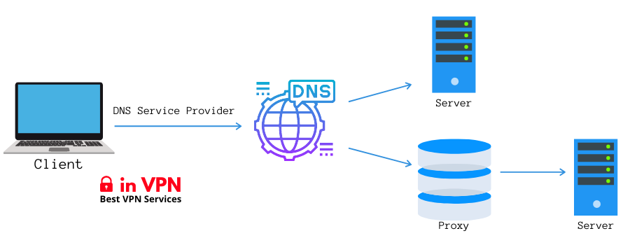

## Smart DNS Proxy

#### What is Smart DNS Proxy 
A Smart DNS is a service you can use to access geo-restricted Internet content. It became extremely popular due to the increased use of geo-blocking technology by content providers like Netflix. The service allows you to hide your geo-location, meaning you can watch geo-blocked content from anywhere in the world

The Nginx config file is based on this [module](http://nginx.org/en/docs/stream/ngx_stream_ssl_preread_module.html) 

It works without the need to install additional software that drains your mobile phone battery. You only need to set a global DNS.



#### Configure on Android
Use Private DNS
https://www.zdnet.com/article/how-to-turn-on-private-dns-mode-on-android-and-why-you-should/

#### Configure on iOS
I don't know let me know if it's possible without third party apps

#### Requirements
- [Docker install](https://docs.docker.com/engine/install/ubuntu/) 
- [docker-compose install](https://docs.docker.com/compose/install/)
- [AWS EC2 free tier](https://aws.amazon.com/free/?all-free-tier.sort-by=item.additionalFields.SortRank&all-free-tier.sort-order=asc&awsf.Free%20Tier%20Types=*all&awsf.Free%20Tier%20Categories=*all) or [VPS](https://www.digitalocean.com/products/droplets/)

#### Obtain a DNS entry
You can get a free domain here: https://freedomain.one/
For example, linkpc.net should work fine with Let's Encrypt.

#### Obtain an SSL certificate from the remote machine
`sudo certbot certonly --standalone -d www.EXAMPLE.com`

#### Run it by yourself 
:warning: Make sure ports 80, 443, 53, and 853 are not in use on your system

Linux:

```
sudo lsof -i :443
sudo lsof -i :80
sudo lsof -i :53
sudo lsof -i :853
```
 
if you want to add your NAME record and IP address you can add or edit this file ```smartdns/smartdns.conf``` you have to replace ```127.0.0.1``` with your ```PUBLIC IP‍ ```‍

Mount smartdns.conf along with SSL certificates issued by Let's Encrypt

```Dockerfile
volumes:
      - ./smartdns/smartdns.conf:/etc/smartdns/smartdns.conf
      - /etc/letsencrypt/live/www.EXAMPLE.com/fullchain.pem:/etc/smartdns/fullchain.pem
      - /etc/letsencrypt/live/www.EXAMPLE.com/privkey.pem:/etc/smartdns/privkey.pem
```

#### Example:
If you want to add the chatgpt.com domain:

```conf
    address /chatgpt.com/PUBLIC IP‍
```

You can build and pull the images:

```bash
docker-compose build
docker-compose pull
```

#### Run Smart DNS
You can start the project with the following command:

```bash
docker-compose up -d
```
